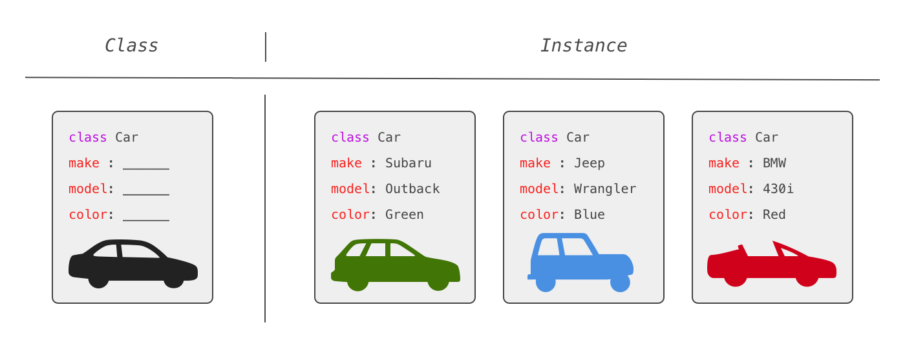

# Object Oriented JavaScript

_____

Students will be able to:
 * use their own definition of <b>OOP</b> to model a real world object.
 * create and use <b>constructor functions</b>.
 * define a JavaScript class with at least one <b>property</b> and one <b>method</b>.
 * discuss how constructor functions are related to <b>classes</b> in JavaScript.
 * live-demo the creation of a <i><b>new</b></i> <b>instance</b>.


## What is Object Oriented Programming?
###### (10 min / 0:12)
 ____

 Object oriented programming is a paradigm of Software Engineering that attempts to solve the problems of building applications imperatively by <b> organizing applications into discrete units, called objects.</b> Rather than <i> imperatively </i> describe everything we want our application to do, <b>in OOP we define objects that represent our understanding of the different parts of our application, what information describes those parts and what behavior those parts have.</b>

 

 <ol>
 <li>What kind of page is this?</li>
 <li>What properties of this page are specific to the User-type?</li>
 <li>What properties of User-type are consistent across other User-types? All User-Types?</li>
 <li>What methods might this profile possess? What methods are available to the current User logged in? </li>
 </ol>

 ### Data Structures
 

 ```
 class User:
  def __init__(self, id, name, gender, birthday, location):
    self.id = id
    self.name = name
    self.gender = gender
    self.birthday = birthday
    self.location = location

 Batman = User(4579005300097, "Brucy", "Male", 01/01/1939, "Gotham City")

 print('I am' + Batman.name)
 ```
 LOOKS LIKE
 ```
  Batman {
    id: 4579005300097
    name: Brucy
    gender: Male
    birthday: 01/01/1939
    location: Gotham City
  }
 ```
 ### What

 Every object stores and manages any state or data relevant to itself internally.
 We almost always have many instances of a type of object. We use methods to initialize, modify, or act on an objects' internal state. Because these methods will be the same across all instances of a type of object, we define a single class with all of this behavior described in one place. We then use that class to instantiate as many instances (objects) of the class as we need.
___

### Why

Object oriented programming gives use three major benefits:

<b> Encapsulation: </b> The complexity of our objects is hidden and a user can interact with a well defined set of methods. We can redefine internal behavior without changing anything externally - a huge benefit for refactoring.

<b> Modularity: </b> Because the interface (set of methods) for an object is well defined, it is easy to exchange one object for another and reorganize objects without breaking them.

<b> Inheritance: </b> Object Oriented design lets certain classes inherit from, or borrow the behavior of another, more general class. The inheriting class can add and overwrite inherited methods.

You can think of an object as a little machine: it has displays you can read and buttons you can push. When you write an object-oriented application, you are modeling the entire program as the interactions of these machines.
___

### How

 Lets look back at our vocab:
 * Classes and Instances

Classes (sometimes referred to as Types) are the fundamental building block of OOP. A class is a type of object (the template from above). You've already worked with some: i.e. Arrays, Numbers, Strings. Those classes are built in to the language. We never had to define what an Array was or what methods it had, we could just start creating arrays. The arrays we created are all instances of the Array class.

``
var myArr = [0,1,2,3,4,5]
``

The distinction between classes and instances may seem foreign and technical but, in reality, it is very similar to how we think about the real world:

I can say "imagine a car" and we have no problem doing so. I can also point at something, ask "is that a car?" and get near universally consistent answers. We can even look at a blueprint for the car and it will have a description, a basic drawing, and technical specifics about the car it represents.

The general idea of a car is a class; each individual car is an instance:


* Attributes and Methods

If we want to create our own classes, all we need is a name for our class and a definition of the information and behavior we want to encapsulate in our class. The information and behavior we want to describe with our class has a special name: an attribute. There are two kinds of attributes: data attributes and procedural attributes (more commonly called methods).

Our class definition will include all of the attributes and methods we want for every instance of the object.

We can think of our class definition as a template for what we want each individual instance of that class to look like. But how will we use our class definition to actually create instances of that class?

* Constructor

The last thing our class definition needs is a constructor: a special method that will be invoked whenever we create a new instance of our class. If our class is what defines our template, the constructor method is what fills it in for a particular instance.

> Self (or this)
We'll need some placeholder reference for each instance that has yet to be created with our new class definition. In most OOP languages, this is referred to as self, though in JavaScript it's <b>"this"</b>.

Why do we need this placeholder? Well, each instance we create with our class will have it's own attributes.
When we want to represent that in our class definition, we want to represent that the attributes are part of the class but the values for attributes are part of the instance of that class. So we'll attach these values to a placeholder (self or this, depending on the language) and when our constructor method is invoked, it will attach those values on the new object.

___

### All Together Now -- Exercise



 Here is a list of the attributes and methods we could include:

 Attributes:

 * Make
 * Model
 * Year
 * Color
 * Mileage
 * Fuel Level

Methods:

 * Drive
 * GPS
 * Fill Fuel Tank

 ### Inheritance (10 min / 1:05)

Now that we've covered Encapsulation, & Modularity, Lets talk about <b> Inheritance. </b>

Our Car class is relatively simple at the moment. But we can create new instances of our Car class and have everything we need to work with a car. This is "encapsulated."
Because every object representing a car follows the same template, we can say our object is modular.

Inheritance is a key component of the OOP paradigm. We can understand it by thinking through some new information for our Car scenario:

Lets say we have a client that owns boats and motorcycles, in addition to cars. A lot of the data for these three types of vehicles will be the same: they'll have different mileage, for instance. But they'll also have some unique data: a car has doors (two or four) while a motorcycle and boat do not. How can we capture this in our application?

#### DON'T

One way would be to define 3 separate classes and duplicate any shared attributes or methods. This is not a good solution though because at some point, we'll probably need to change something (like maybe we start renting per hour instead of per day) and we'd need to update all three classes to reflect that change.

#### DO

Instead, we'll use the concept of inheritance: we'll create a Vehicle class and define all our shared attributes and methods there. We'll then create three classes that inherit from that Vehicle class (Car, Boat, and Motorcycle classes). By inheriting from another class, each sub-class will adopt the attributes and methods of it's parents and we can define unique attributes and methods for separate instances of the vehicle class.

```
Class Car extends Vehicle
  Make:
  Model:
  Year:
  Color:
  Mileage:
  Fuel Level:
  doors: 4

```
```
Class Motorcycle extends Vehicle
  CCs:
  TireSize:
  Exhaust: Stock
```
```
Class Bike extends Vehicle
```
___

CODERISE : RENT-A-CAR (10 min)


<ol>
  <li>Create a vehicle constructor</li>
  <li>Include properties of all vehicles and outline methods of all vehicles</li>
  <li>Create a car and/or motorcycle subclass that extends the Vehicle class</li>
  <li> Super(); </li>
  <li> Instantiate a new instance of the subclass with Vehicle properties</li>
</ol>

```
class Vehicle {
  constructor(make, model, year, color, num_wheels) {
    this.make = make;
    this.model = model;
    this.year = year;
    this.color = color;
    this.num_wheels = num_wheels;
  }
  drive(){
    return `the ${this.make} ${this.model} is headed north`
  }
  stop(){
    return ` the ${this.make} ${this.model} is breaking`
  }
}

class Motorcycle extends Vehicle {
  constructor(make, model, num_wheels, ccs){
    super(make, model, num_wheels);
    this.ccs = ccs;
  }
}
```


